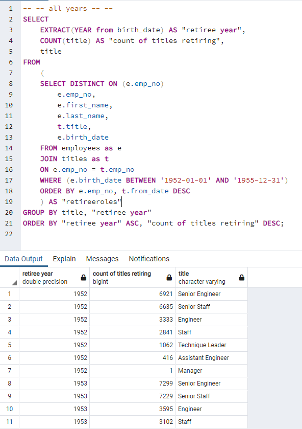

# Pewlett-Hackard-Analysis

## Overview

The purpose of this repository is twofold. Purpose one is to hold the schema and raw data for an employee database for Pewlett Hackard. The second is to hold SQL queries for re-running and output data from these queries in csv formats. The a copy of the database may be created running the queries in the [schema](/schema.sql) and importing the data from [departments](/Data/departments.csv), [employees](/Data/employees.csv), [department-employees](/Data/dapt_emp.csv) (into dept_emp), [department-managers](/Data/dept_manager.csv), [salaries](/Data/salaries.csv), and [titles](/Data/titles.csv) into their respective tables. 

A duplicated database's structure will look something like below. 

[Queries](/Queries/queries.sql) may then be run to output filtered data from the above database and saved into csv files found in the data folder. Of particular interest is retirement information whose queries may be found [here](/Queries/Employee_database_challenge.sql) to prepare for the "silver tsunami"

## Results

Running the first three and last of the [queries relevant](/Queries/Employee_database_challenge.sql), we create the below output tables that are then saved in csv format.
* [retirement_titles.csv](/Data/retirement_titles.csv)
* [unique_titles](/Data/unique_titles.csv)
* [retiring_titles](/Data/retiring_titles.csv)
* [mentorship_eligibilty.csv](/Data/mentorship_eligibilty.csv)

Snippets of each table are labelled and shown below.

Retirement titles: the purpose of this query is to retrieve the employees born between 1952 and 1955 (ordered by employee number) 

Unique titles: the purpose of this query is to narrow down the above data to only display one employee number where duplicates were caused by department switches or promotions.

Retiring titles: the purpose of this query is to provide a count of how many titles being held by employees are set to retire.

Finally, the last query in the sql, we are extracting from the raw data a mentorship eligibility, specifically with conditions of "being a current employee" and "born between January 1, 1965 and December 31, 1965".

## Summary

### How many roles will need to be filled as the "silver tsunami" begins to make an impact?

**A total of 90398 employees would be retiring and would need that many roles would need to be filled.** In particular, senior engineers, senior staff, engineers, staff, technique leader and assistant engineers (a total of 7 role types) need to be fulfilled. Under the assumption that employees are retiring at age 65, some employees have loyally continued to work past this age. We can expect employees born in 1952 to want to retire first so it is crucial to establish how many roles need to be fulfilled from this set of retirees first. We can break down the replacements into priorities by year for instance using this [attached sql](/Queries/RetirementTitlesByYear.sql) whose query & results can be seen below.

### Are there enough qualified, retirement-ready employees in the departments to mentor the next generation of Pewlett Hackard employees?

In order to mentor the next generation of Pewlett Hackard employees, it is necessary to understand the number of retirement ready employees and mentorship eligible employees within their respective departments. We can use [this query](/Queries/CountMentorshipEligibiltyByDept.sql) to establish the count of mentorhsip eligible employees within the departments then use [this query](/Queries/CountRetiringByDept.sql) to establish the count of retirees within the departments. From there, it is possible to manually subtract each departments retiring employees to mentorable employees, but it'd be much simpler to create a query to do so such as [this one](/Queries/MentorsAvailable.sql); we can even perform arithmatic operations and use if statements to provide us with a clear cut answer. **For this particular case, there are definitely enough qualified, retirement-ready employees, whom are also still currently working in the departments to mentor the next generation (ie: people born in 1965 specifically) of Pewlett Hackard employees.

We could even consider those born after 1965 by adjusting the query's WHERE condition to be between 1965-01-01 and 9999-12-31 which will provide the same result in this case.

